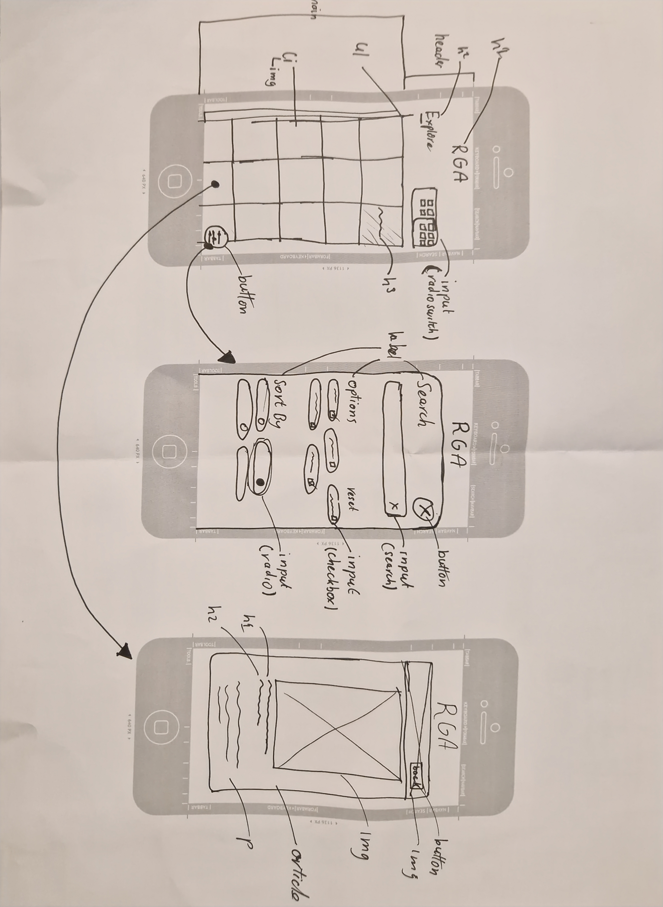

# Web App From Scratch

## Inleiding
Voor dit vak is het de bedoeling dat je een van de onderstaande user stories kiest om vervolgens een single page webapplicatie te designen en bouwen. De user stories zijn:
- As a student Digital Design, I want to look at inspiring web design quotes, to get some fresh energy when I'm down while working on crazy deadlines.
- As an art lover, I want to be able to search and view art from the Rijksmuseum at home, so that I can still enjoy art during a lockdown Rijksmuseum
- As a frisbee player, I want to be able to save and pass on the scores of a match, so I know where and when we have to play the next game. Frisbee Tournament
- As a foodie, I want to be able to easily search and view information about a product while shopping, so that I can make a good choice whether it fits my diet. Healthy Food Checker
- As a patient, I want to be able to make a reliable diagnosis at home, so that I can better estimate whether I should make an appointment with the doctor.
- As a children's book author, I want to experiment with innovative Dutch-language voice interaction patterns, so I can tell my stories in an entirely new way.

De opdrachten en de details zijn terug te vinden op de [de website van het vak](https://github.com/cmda-minor-web/web-app-from-scratch-2223/blob/main/course/week-2.md#1-pick-a-user-story-and-sketch-the-user-interface).

De opdrachten moeten worden gemaakt worden met behulp van html, css en vanilla javascript.
Je moet zo weining mogelijk gebruik maken van libraries en frameworks.

**Uitzondering voor javascript**:  
    Micro libraries zijn toegestaan, wanneer dit nodig zou zijn.

## Week 1: Planning

### User story
De opdracht waar ik voor heb gekozen is: As an art lover, I want to be able to search and view art from the Rijksmuseum at home, so that I can still enjoy art during a lockdown Rijksmuseum

### Technieken
De technieken die ik wil gaan gebruiken zijn:
- fetch: Voor het ophalen van de datas
- intersection observer: Voor het laden van de list items met een delay en animatie
- lazy loading: Voor het laden van de afbeeldingen
- local storage: Voor het opslaan van de favorieten(Als er tijd over is)

### Schetsen

### Peer review
Bij de eerste testen van mijn web applicatie heb ik wat feedback gekregen van mijn mede studenten.

De feedback die ik heb gekregen van Danien:
- Comments toevoegen in de code, zodat ik weet waar ik mee bezig was
- Pixels proberen te vermijden in plaats daarvan Ems en Rems of viewport units

De feedback die ik heb gekregen van Laurens:
- De custom properties kunnnen consistenter toegpast worden
- Kijken of ik de lazyloading iets beter kan toepassen en of dit mijn applicatie niet breekt