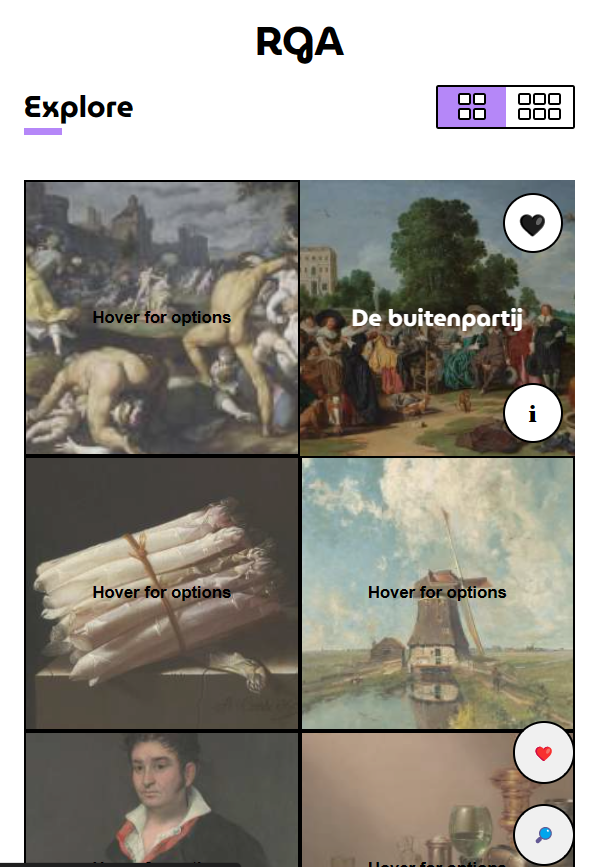
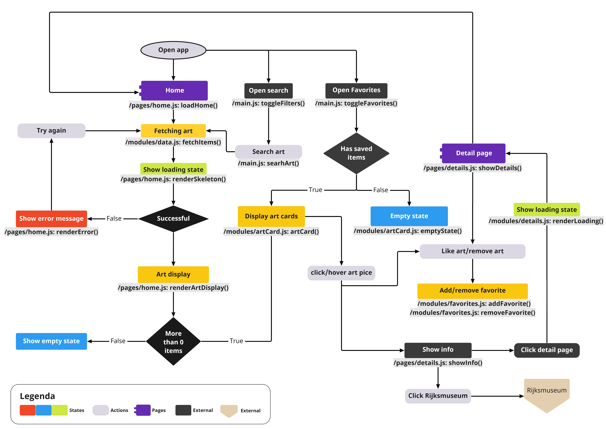

# Rijksmuseum Gallery App

## Table of Contents

- [Rijksmuseum Gallery App](#rijksmuseum-gallery-app)
  - [Table of Contents](#table-of-contents)
  - [Full Documentation](#full-documentation)
  - [Live Demo](#live-demo)
  - [Description](#description)
  - [Poster Image](#poster-image)
  - [Installation](#installation)
  - [Usage](#usage)
  - [Activity Diagram](#activity-diagram)
  - [External Data Source](#external-data-source)
  - [Checklist](#checklist)
  - [Wishlist](#wishlist)

## Full Documentation
This readme is a quick overview of the project.
For the full documentation, please visit my [Github Wiki](https://github.com/WyroneBlue/rijksmuseum-gallery-app/wiki)

## Live Demo
Visit our live demo in Github Pages [here](https://wyroneblue.github.io/rijksmuseum-gallery-app/).

## Description
The Rijksmuseum Gallery App is a web application that allows users to browse and search through a collection of art pieces from the Rijksmuseum. Users can also filter and sort the collection, and save their favorite pieces for later viewing. The app is built using HTML5, CSS3, and Vanilla JavaScript.

## Poster Image


## Installation
To install this project, simply clone the repository and open `index.html` in your web browser.

```sh
git clone https://github.com/your-username/rijksmuseum-gallery-app.git
cd rijksmuseum-gallery-app
```

open index.html in your browser of choice, but preferably a chromium-based browser like Google Chrome or Microsoft Edge.

## Usage
The Rijksmuseum Gallery App has the following features:
- Search for art pieces by keyword
- Filter art pieces by top pieces and image availability
- Sort art pieces by relevance, type of art, oldest, newest, and artist name
- Save view and remove favorite art pieces
- Access the search and favorites list from the menu in the bottom right corner

## Activity Diagram


## External Data Source
The Rijksmuseum Gallery App uses the Rijksmuseum API as its external data source. The API provides a collection of high-resolution images and metadata for art pieces in the Rijksmuseum's collection.

## Checklist
Here's a list of what we have accomplished so far and what is still on our wishlist:

Done
- [x] Set up project folder structure and modules
- [x] Get API key from Rijksmuseum
- [x] Fetch data from Rijksmuseum API
- [x] Display art pieces with lazy loading and infinite scroll
- [x] Add loading animation
- [x] Add menu for accessing search and favorites list
- [x] Implement search and filter functionality
- [x] Implement sorting functionality
- [x] Implement favorites list with local storage
- [x] Write documentation
- [x] Create wireflow diagram

## Wishlist
- [ ] Better error handling
- [ ] Add better support for mobile devices and certain browsers
- [ ] Add support for multiple languages